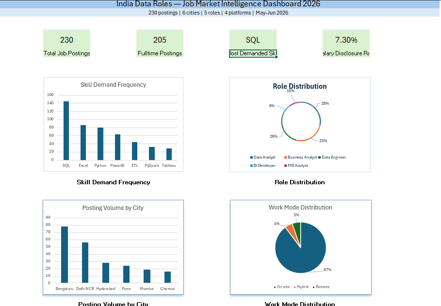

# India Data Roles-Job Market Intelligence Dashboard 2026

## Overview
An end-to-end market intelligence project analyzing 230 real 
job postings across 6 Indian cities, 5 data roles, and 4 
hiring platforms — built entirely in Microsoft Excel.

## Problem Statement
India's data job market suffers from severe salary opacity 
and fragmented hiring signals. This project quantifies skill 
demand, compensation trends, and city-level hiring patterns 
to help freshers make data-driven career decisions.

## Key Findings
- SQL is the most demanded skill appearing in 63% of postings
- Only 7.3% of full-time postings disclosed salary — 
  confirming widespread compensation opacity in India
- Bengaluru accounts for 33.7% of all data role postings
- Power BI outpaces Tableau (27.39% vs 12.61%) reflecting Microsoft's 
  stronger enterprise penetration in Indian market
- 88% of roles require on-site presence — remote work 
  remains rare for entry-level data roles

## Dataset
| Attribute        | Details                                    |
|------------------|--------------------------------------------|
| Total Postings   | 230 (205 full-time + 25 internships)       |
| Cities Covered   | Bengaluru, Delhi NCR, Hyderabad, Pune,     |
|                  | Mumbai, Chennai                            |
| Roles Analyzed   | Data Analyst, Business Analyst,            |
|                  | Data Engineer, BI Developer, MIS Analyst   |
| Platforms        | LinkedIn, Naukri, Foundit, Internshala,    |
|                  | Unstop                                     |
| Collection Period| May–June 2026                              |

## Workbook Structure
| Sheet            | Contents                                   |
|------------------|--------------------------------------------|
| RAW_DATA         | 230 manually collected job postings        |
| SKILL_MATRIX     | Skill frequency + co-occurrence analysis   |
| SALARY_INSIGHTS  | Compensation transparency analysis         |
| CITY_TRENDS      | City-wise volume, role and work mode data  |
| INSIGHTS         | Written findings and recommendations       |
| DASHBOARD        | Visual summary with KPI tiles and charts   |

## Tools & Techniques
- Microsoft Excel — COUNTIFS, AVERAGEIFS, SUMPRODUCT,
  array formulas, conditional formatting, PivotTables
- Manual data collection and quality validation
- Outlier detection and handling
- Keyword-based skill extraction from raw job descriptions

## Skills Tracked
SQL, Python, Power BI, Tableau, Excel, ETL, 
Machine Learning, Statistics, Data Modelling, 
A/B Testing, Pandas, NumPy, Data Visualization,
PySpark, AWS, GCP, Hadoop, MIS Reporting

## Dashboard Preview

## Key Excel Techniques Used
- COUNTIF with wildcards for skill detection
- SUMPRODUCT for skill co-occurrence analysis  
- AVERAGEIFS with outlier exclusion
- Conditional formatting heatmaps
- Dynamic helper tables feeding chart visualizations

## Methodology
Data was manually collected from 5 platforms between 
May–June 2026. Only postings targeting 0–3 years 
experience were included. Salary analysis is based on 
15 disclosed full-time postings (7.3% of dataset) — 
treated as directional, not statistically conclusive. 
Delhi NCR consolidates Delhi, Noida, Gurgaon postings 
as one hiring region.

## Author
Gurpreet Kaur
